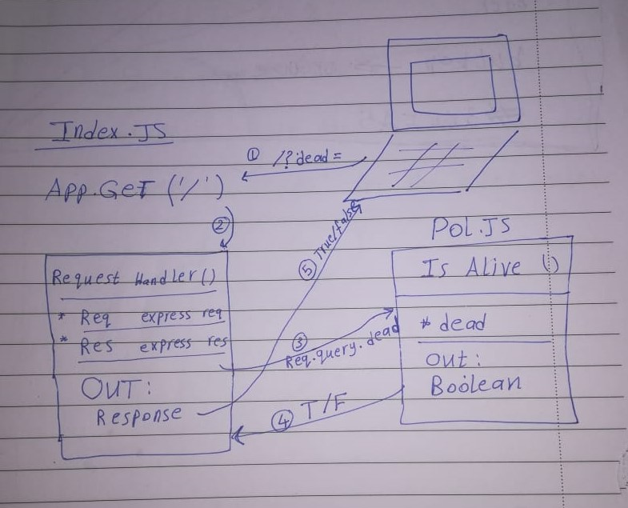

# LAB - 00

## Project: Proof of life server

### Author: Esra'a Mamoun

### Links and Resources

- [submission PR](https://github.com/EsraaMamoun-401-advanced-javascript/lab-00/pull/1)
- [travis](https://travis-ci.com/github/EsraaMamoun-401-advanced-javascript/lab-00/builds/164962151) 
- [front-end application](https://esraa-lab-00.herokuapp.com/) 

#### Documentation
- [jsdoc](https://esraa-lab-00.herokuapp.com/docs/) 

### Modules

#### `pol.js`

##### Exported Values and Methods

###### `isAlive (dead) -> boolean`
Return true/false to indicate how the server works.

### Setup

#### `.env` requirements

- `PORT` - 3000

#### How to initialize/run your application 

- `npm start`
- `live-server`

#### Reviewing the app

- Endpoint: `/`
  > Returns a boolean

- Endpoint: `/docs`
  > Returns JSDoc decumentation pages

#### Tests

- Unit Tests: `npm test`
- Lint Tests: `npm lint test`

Incomplete tests: 
- Need to test xyz...

#### UML

